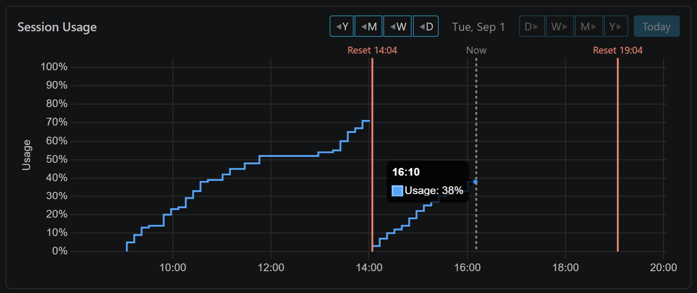
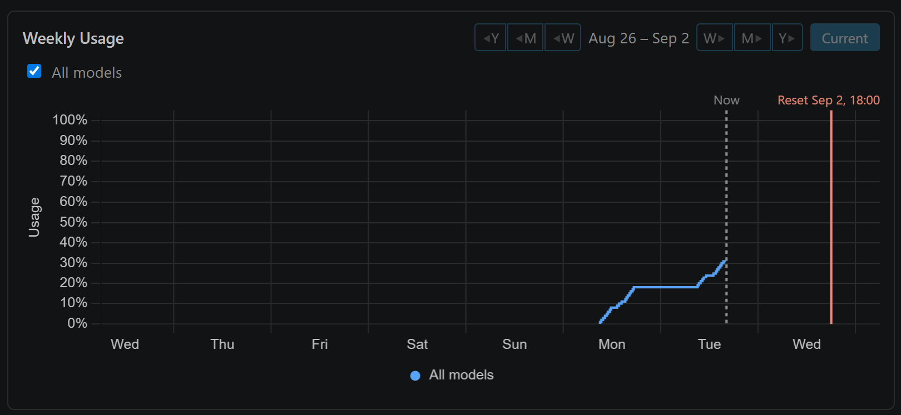
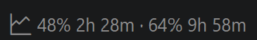

#  Claude Usage Graph

A Visual Studio Code dashboard for the usage limits on your Claude subscription.
It records where your 5-hour session pool and your weekly allowance actually go,
keeps a rolling history you can page back through, and puts both numbers in the
status bar so you can stop guessing how much is left.

<!--
  Nothing here encodes the captures' pixel dimensions, because they are taken by
  hand and change between shoots. `width="49%"` splits the row evenly whatever
  size the files are; percentages also keep the pair responsive on a narrow
  Marketplace column.

  The two panels are not the same shape and cannot be — the weekly one carries
  the series toggles and a legend — so at equal widths their heights differ.
  `align="top"` puts that difference at the bottom edge; without it, inline
  images sit on the text baseline and the *tops* stagger, which looks broken.
  Do not "fix" this by setting `height`: that equalises the heights but makes
  the widths unequal instead, and hard-codes today's aspect ratios.
-->
<p>
  
  
</p>
<p>
  
</p>

> **Unaffiliated with Anthropic.** This extension reads an undocumented endpoint
> that Claude Code uses internally. It can stop working without notice. See
> [How it works](#how-it-works-).

---

## Key features ✨

- **Your week has a shape.** The steep climb on Thursday afternoon is the bug
  that fought back; the long flat stretch is the meeting you sat through. Both
  graphs draw spending against the clock, so a percentage turns back into an
  afternoon you remember.
- **Both numbers, without opening anything.** The status bar carries your 5-hour
  pool and your weekly allowance, each with a countdown to its own reset —
  `48% 2h 28m · 64% 9h 58m`. Click it for the full dashboard.
- **A history you can page through.** Go back through earlier sessions and
  earlier weeks to see whether the one you are having is unusual, or just what
  your weeks look like.

### Under the hood 🔧

- **Cheap.** One request per machine every three minutes, no matter how many
  VS Code windows you have open — they share one schedule between them.
- **Local.** Everything is stored in the extension's own directory on your
  machine. Nothing is uploaded, proxied, or sent anywhere. See
  [Privacy](#privacy-).
- **Small.** One file per session and per weekly cycle. Hours of idleness
  compress to two rows, and anything past the retention window — a year unless
  you change it — is deleted in the background once a window opens. A year of
  history is about 1.5 MB.
- **One history across every project.** Under Remote-SSH, Dev Containers, WSL or
  Codespaces the extension still runs on your own machine, so remote work lands
  in the same history as local. See [Remote development](#remote-development-).

---

## Requirements 📋

- **A Claude Pro or Max subscription.** These usage figures do not exist for
  API-key accounts.
- **Claude Code installed and signed in on your local machine.** The extension
  has no login of its own — it reads the session Claude Code already maintains,
  and never writes to it.

If you are not signed in, the status bar says so, and tracking starts by itself
within three minutes of your running `claude` and logging in. There is nothing
to reload.

---

## Quick start 🚀

1. Make sure `claude` is installed and you are signed in.
2. Open the Command Palette (`Ctrl + Shift + P` / `Cmd + Shift + P`).
3. Run `Claude Usage: Open Dashboard`.
4. Drag the tab into a split view if you want it beside your code. The charts
   refresh on their own.

Tracking begins when VS Code starts, whether or not you ever open the dashboard,
so the history is already there the first time you look.

---

## The dashboard 📈

### Session Usage


One local day of 5-hour session windows.

Each session is a separate counter that fills from 0% and expires five hours
after your first message, so the graph is a run of separate climbing lines
rather than one continuous one. A line rises when you spend, stays flat while
you are idle, and stops at the red `Reset` line where that window expired. The
next session starts a fresh line from the bottom — the gap between them is real,
and joining the two would draw a plunge that never happened.

This is a calendar day you page through, not a fixed span that slides backwards
from the current moment, so no two days look alike. A session belongs to the day
it *started* on: a burst that began at 23:00 and expires at 04:00 is filed under
the night you started it, and the axis simply follows it past midnight. That is
why a day can hold up to 29 hours.

The axis is clipped to the sessions that exist, with an hour of breathing room
on each side — if your first session began at 07:00 the chart starts at 06:00
rather than padding out eight empty hours before you sat down. A day with no
sessions says so instead of showing a blank grid.

Navigate a day, a week, a month or a year at a step — `◀ Y M W D` back and
`D W M Y ▶` forward, one letter to a button — plus `Today`. A page is always one
day; the bigger steps change how far a click moves, not how much is drawn. The
buttons switch off at each end: forward once you are back at today, backward
once you reach the oldest day you still have history for.

### Weekly Usage


One weekly allowance cycle, anchored to Anthropic's reset boundary rather than
to midnight, with half a day of margin at each end so the line never runs into
the frame. Day ticks mark the weekdays, a dashed line marks now, and a red
`Reset` line marks the exact moment your allowance rolls over.

Like the session graph this is a paged view, one cycle to a page: `W` steps one
cycle, `M` four and `Y` fifty-two, backward or forward according to which side of
the date the button sits on, with `Current` to return to the live one. The
backward buttons switch off at the oldest cycle on record.

The graph draws one series per weekly window your plan actually reports, and it
works out which those are from the data rather than from a built-in list. Every
plan has All models. Some also meter particular model tiers against their own
sub-allowance, and each of those gets its own line, labelled from the name the
endpoint uses. Toggle any of them off; your choice is remembered.

A series appears the first time a window reports a figure and stops being drawn
once it no longer does, so changing plan needs nothing from you and no version of
this extension needs to have heard of a tier to chart it. Historical pages keep
whatever they recorded at the time.

Each line is a percentage of its own allowance with its own reset, so they are
not on a common scale, and All models will not equal the per-model lines added
together.

Paging back to last Tuesday keeps you on last Tuesday. A refresh arrives every
few minutes and updates the numbers underneath you, but it never jumps the view
back to the present while you are reading.

### The status bar


The 5-hour pool and its countdown, then the weekly allowance and its own. Hover
for the labels and the wall-clock reset times the countdowns hide; click to open
the dashboard.

Between sessions the first figure reads `idle` rather than a stale percentage —
there is no open window to be a percentage of, and your next message is what
starts the next five hours. If you are not signed in, or Claude Code's session
has expired, the item says which and changes colour, and the tooltip tells you
what to do; tracking resumes by itself within three minutes of your signing back
in. Turn the whole item off with
`claudeUsageGraph.showStatusBar`.

---

## How it works 🔍

The extension polls `api.anthropic.com/api/oauth/usage` every 180 seconds — the
interval community tooling has settled on for an endpoint that answers bursts
with a 429 carrying no `Retry-After`. On a rate limit it backs off
exponentially, and only one window per machine ever makes the call.

That endpoint is undocumented, its beta header is dated, and requests must
identify as Claude Code to avoid punitive throttling. This is unsupported
territory and it may break. Everything that depends on the wire format is
confined to a single module, so a change costs one file rather than the whole
extension.

### Coverage, honestly

Tracking rides on the session token Claude Code maintains, which lasts about
eight hours. The extension never refreshes it — renewal is entirely Claude
Code's job, and we simply notice the new token on the next poll.

The practical consequence: if you do not open Claude Code for a long stretch,
the token lapses and the ledger has a hole. That gap is drawn as a real break in
the line rather than smoothed over. It is a deliberate trade for never touching
your credentials.

---

## Privacy 🛡️

- **The extension stores no credentials of its own — anywhere.** It reads the
  token Claude Code already holds and uses it for one read-only GET. There is no
  refresh flow, no token in settings, nothing in SecretStorage, and no write path
  to your credential store at all. That is enforced structurally rather than by
  convention: the credential module has exactly one method, and a unit test fails
  the build if a mutating one is ever added.
- **Your data stays on your machine.** Time series are written to a private
  directory inside the extension's own storage. Nothing is proxied, uploaded, or
  sent to any telemetry endpoint.
- **It stays small.** One file per session and per weekly cycle. Idle time
  compresses to two rows however long it lasts, and files past the retention
  window are deleted in the background once a window opens.

---

## Settings and commands ⚙️

| Setting | Default | Description |
| --- | --- | --- |
| `claudeUsageGraph.showStatusBar` | `true` | Show current 5-hour and weekly usage in the status bar. |
| `claudeUsageGraph.hiddenSeries` | none | Weekly Usage series to hide, by column key (`seven_day`, `seven_day_opus`, …). Empty shows every series your plan reports. |
| `claudeUsageGraph.retentionDays` | `365` | How many days of history to keep, counted from when each window finished. Takes effect on reload; lowering it deletes the files that fall outside, a little at a time in the background, so a large reduction can take a while to finish. |
| `claudeUsageGraph.useMockData` | `false` | Replay bundled synthetic fixtures instead of contacting Anthropic. Intended for development. |

There is no token setting, by design. A credential in `settings.json` is
plaintext, rides Settings Sync, and ends up in dotfile repositories.

Four commands, all under the `Claude Usage:` prefix in the Command Palette:
`Open Dashboard`, `Refresh Now`, `Open Settings` and `Show Logs`. The last two
are also icon buttons in the dashboard tab's title bar, at the top right.

---

## Remote development 🌐

The extension declares `"extensionKind": ["ui"]`, so it always runs on your local
machine even when you are working over Remote-SSH, in a Dev Container, in WSL, or
in a Codespace.

That is deliberate. Usage is account-global, so it makes no difference *where* we
ask — but running locally means one unified history across every project
and every remote, one poller, and credentials maintained by a machine that has a
browser to log in with.

If you only ever sign into Claude Code on a remote host, override it:

```jsonc
"remote.extensionKind": {
  "27068.claude-usage-graph": ["workspace"]
}
```

---

## Development 🛠️

Requires Node 24, pinned in `.node-version` so `fnm`, `nvm` and `volta` all pick
it up automatically.

```bash
npm install
npm run compile
npm run test:unit    # plain mocha — no VS Code, no network, no display
```

Press <kbd>F5</kbd> for an Extension Development Host. Development mode
automatically replays `fixtures/mock-usage.json` through the real pipeline —
normalizer, dedupe rules, dead-zone detection, file rollover — so the synthetic
run exercises the same code a live run does. The fixture deliberately contains a
long idle run, a sudden jump, a gap *with* a value change (must break), a gap
*without* one (must not), a session rollover, and a session crossing midnight.

The webview is bundled by esbuild into `media/dashboard.js`, so a change under
`src/webview/` shows up only after `npm run compile` — `npm run watch` rebuilds
the extension host alone. That trap, an architecture and file-structure tour, and
the chart sizing gotchas are all written up in `docs/DEVELOPING.md` in the
repository. Machine-specific setup (toolchain paths, local storage locations)
goes in `docs/LOCAL.md`, which is gitignored.

The source is laid out around one rule:

- `src/core/` — the persistent engine. Contains no `import * as vscode` at all,
  which is what lets the entire test suite run in a terminal.
- `src/vscode/` — thin adapters implementing the interfaces `core` declares.
- `src/auth/` — the read-only credential reader, kept vscode-free for the same
  reason and guarded by tests that fail if a write or refresh path appears.

---

## License 📄

GNU Affero General Public License v3.0. The full text ships alongside this file
as `LICENSE`.

If you run a modified version of this extension as a network service, the AGPL
requires you to offer users of that service the corresponding source.

Third-party components are listed in `THIRD-PARTY-NOTICES.md`.
